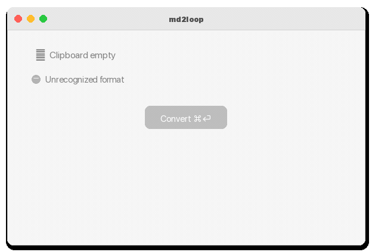
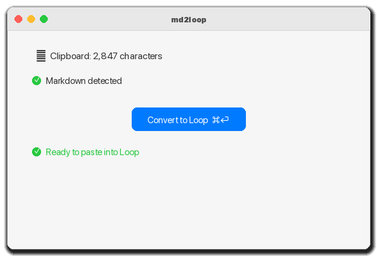
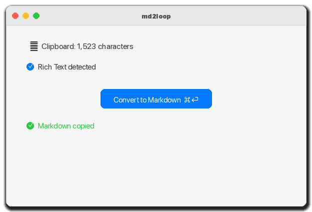
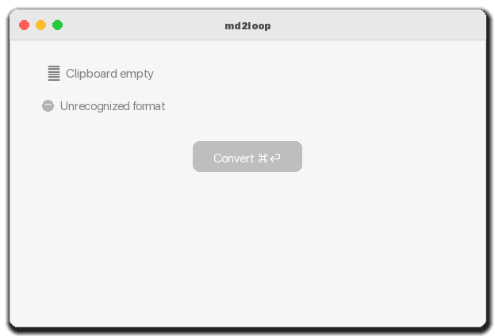

<p align="center">
  
</p>

<h1 align="center">md2loop</h1>

<p align="center">
  A lightweight macOS utility that converts Markdown ↔ Rich Text for seamless pasting into Microsoft Loop.
</p>

<p align="center">
  
  
  
  
  
</p>

---

## Features

- **Markdown → Loop** — Converts clipboard Markdown to optimized HTML/RTF for pasting into Loop
- **Loop → Markdown** — Converts Loop's rich text back to clean Markdown
- **Auto-detection** — Automatically detects content type (Markdown vs HTML)
- **One shortcut** — ⌘⏎ does the right thing based on content
- **Full Markdown support** — Headings, bold/italic, lists, tables, code blocks, task lists, links, blockquotes
- **Native macOS app** — SwiftUI, lightweight, no Electron

## Screenshots

<p align="center">
  
  
  
</p>

## Installation

### Download

Grab the latest release from the [Releases page](https://github.com/trsdn/md2loop/releases).

### Build from source

```bash
git clone https://github.com/trsdn/md2loop.git
cd md2loop
xcodegen generate
xcodebuild -project md2loop.xcodeproj -scheme md2loop -configuration Release build
```

### Release build

The macOS release flow builds a Developer ID signed app, packages it as a signed DMG, notarizes it,
and uploads both the DMG and a SHA-256 checksum to the GitHub Release for a `v*` tag.

Required GitHub Actions secrets:

- `MACOS_CERTIFICATE` — base64-encoded Developer ID Application `.p12`
- `MACOS_CERTIFICATE_PWD` — password for the `.p12`
- `APPLE_ID` — Apple ID used for notarization
- `APPLE_TEAM_ID` — Apple Developer Team ID
- `APPLE_APP_PASSWORD` — app-specific password for notarization

Local release build:

```bash
./scripts/release_macos.sh
```

For local signing and notarization, copy the example release environment and adjust it if needed:

```bash
cp .release.env.example .release.env
xcrun notarytool store-credentials md2loop \
  --apple-id "your@email.com" \
  --team-id "G69Z5BNY97" \
  --password "app-specific-password"
```

The local scripts load `.release.env` by default. Set `RELEASE_ENV_FILE` to use another file.

For unsigned local smoke builds only:

```bash
REQUIRE_SIGNING=0 ./scripts/build_release.sh
```

## Usage

1. Copy Markdown text to your clipboard
2. Open md2loop (or use ⌘⏎)
3. The app detects the content and shows the appropriate conversion
4. Click **Convert** (or press ⌘⏎)
5. Paste into Microsoft Loop (⌘V)

Works the other way too — copy from Loop, convert to Markdown.

## How it works

- Uses [apple/swift-markdown](https://github.com/apple/swift-markdown) for Markdown → HTML via a custom `MarkupVisitor` optimized for Loop
- Uses [SwiftSoup](https://github.com/scinfu/SwiftSoup) for HTML → Markdown
- Sets the clipboard with HTML + RTF + plain text for maximum compatibility
- Loop-specific optimizations: no CSS classes, Unicode checkboxes for task lists (☑/☐), minimal table HTML

## Requirements

macOS 14 (Sonoma) or later.

## Contributing

Contributions are welcome! See [CONTRIBUTING.md](CONTRIBUTING.md) for guidelines.

## License

MIT — see [LICENSE](LICENSE) for details.
